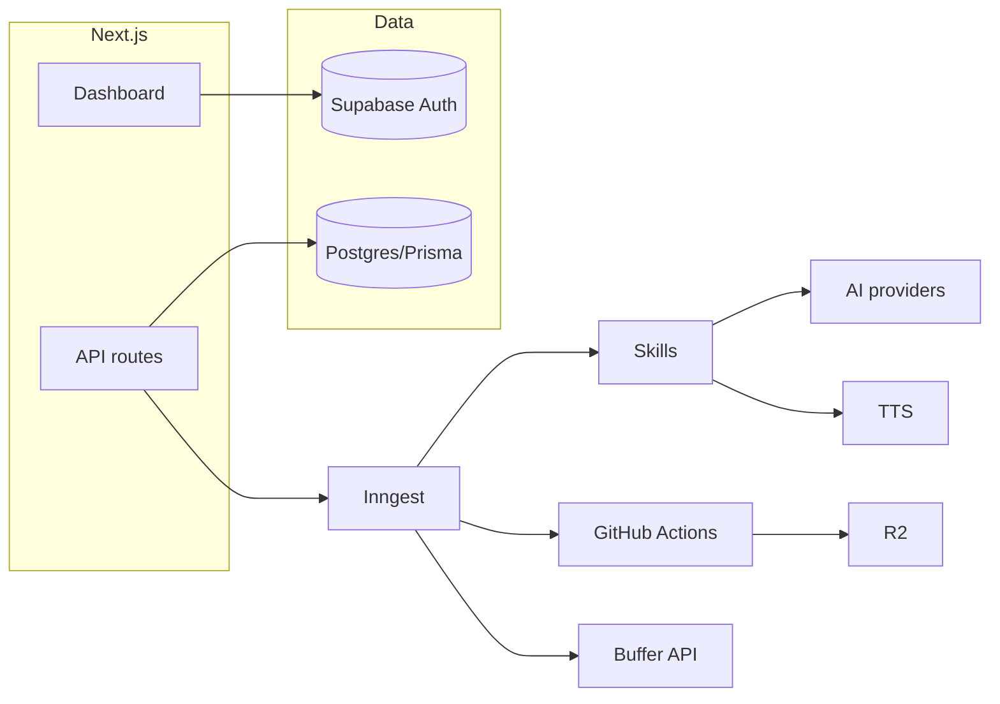

# Fabrica de Contenido

Base de producto tipo **SaaS multi-tenant** para generar y publicar contenido social con IA, video (Remotion + GitHub Actions), TTS gratuito (Microsoft Edge), y publicación vía **Buffer**. Está pensada para **Vercel + Supabase**, con colas **Inngest** y **Prisma** sobre PostgreSQL.

## Arquitectura (resumen)

- **App web**: Next.js 16 (App Router), TypeScript estricto, Tailwind 4, componentes **shadcn** (Base UI).
- **Auth + DB**: Supabase Auth (cookies SSR) + **Prisma** con el mismo Postgres (URL directa en `DATABASE_URL`).
- **Orquestación**: **Inngest** (`src/lib/inngest/`, endpoint `POST/GET/PUT /api/inngest`). Interfaz genérica de cola en `src/lib/queue/types.ts` para un futuro adaptador BullMQ.
- **IA**: fábrica y adaptadores en `src/lib/ai/` (`openai`, `anthropic`, `gemini`, `openrouter`). Las claves las aporta cada tenant; se guardan cifradas.
- **TTS**: `edge-tts-universal` en `src/lib/tts/` (sin API key).
- **Publicación**: Buffer en `src/lib/publishing/providers/buffer.ts`.
- **Video**: disparo de **GitHub Actions** (`src/lib/video/github-actions.ts`) + workflow esqueleto en `.github/workflows/render-video.yml`; activos en **R2** (`src/lib/storage/r2.ts`).
- **Skills**: registro + ejecutor con Zod + trazas en `SkillExecution` (`src/skills/`).
- **Seguridad**: `ENCRYPTION_MASTER_KEY` para AES-256-GCM (`src/lib/encryption/cipher.ts`); validación de env en servidor (`src/config/env.server.ts`).



## Requisitos

- Node.js 22+ (recomendado; probado con 22 alpine en Docker).
- Cuenta **Supabase** (proyecto + URLs en dashboard).
- Opcional: Inngest, Upstash (rate limit), Cloudflare R2, GitHub PAT para render.

## Configuración local

1. Copia variables: `.env.example` → `.env` (o `.env.local`).

2. Arranca Postgres local (opcional):

   ```bash
   docker compose -f docker/docker-compose.yml up -d
   ```

3. Ajusta `DATABASE_URL` (Supabase o el Postgres del compose).

4. Esquema:

   ```bash
   npx prisma migrate dev --name init
   ```

   o, solo en desarrollo rápido:

   ```bash
   npm run db:push
   ```

5. Semilla mínima (definiciones de skills en BD):

   ```bash
   npm run db:seed
   ```

6. En Supabase: **Authentication → URL configuration**  
   - Site URL: tu `NEXT_PUBLIC_APP_URL`  
   - Redirect URLs: `{NEXT_PUBLIC_APP_URL}/auth/callback`

7. Arranque:

   ```bash
   npm install
   npm run dev
   ```

   Rutas útiles: `/` (marketing), `/login` (magic link), `/dashboard` (protegido).

## Variables de entorno

Ver [.env.example](.env.example). Obligatorias para el servidor:

- `DATABASE_URL`, `NEXT_PUBLIC_SUPABASE_URL`, `NEXT_PUBLIC_SUPABASE_ANON_KEY`, `SUPABASE_SERVICE_ROLE_KEY`, `NEXT_PUBLIC_APP_URL`, `ENCRYPTION_MASTER_KEY` (64 hex).

Opcionales: Inngest, Upstash, R2, GitHub (`GITHUB_*`).

**Build / CI**: el `next build` necesita esas variables presentes (puedes usar valores placeholder en pipelines no productivos).

## Docker (app)

Imagen de ejemplo (argumentos de build requeridos):

```bash
docker build -f docker/Dockerfile \
  --build-arg DATABASE_URL=postgresql://... \
  --build-arg NEXT_PUBLIC_SUPABASE_URL=... \
  --build-arg NEXT_PUBLIC_SUPABASE_ANON_KEY=... \
  --build-arg SUPABASE_SERVICE_ROLE_KEY=... \
  --build-arg NEXT_PUBLIC_APP_URL=... \
  --build-arg ENCRYPTION_MASTER_KEY=... \
  -t fabrica .
docker run -p 3000:3000 --env-file .env fabrica
```

## Inngest

- Servidor de funciones: `/api/inngest`.
- Registra el app en Inngest Cloud y apunta la URL de producción a ese endpoint.
- Funciones de ejemplo: `fabrica-health-ping`, `fabrica-content-pipeline-v1` en `src/lib/inngest/functions.ts`.

## TODOs de producción (prioridad alta)

- **Perfiles**: sincronizar `UserProfile` con `auth.users` (trigger SQL o webhook Supabase).
- **Organizaciones**: flujo de creación y `OrganizationMember` tras primer login.
- **RBAC**: roles en BD + comprobación en rutas admin y acciones sensibles.
- **Claves**: UI para alta/rotación/revocado de `EncryptedApiKey` solo server-side; nunca exponer material al cliente.
- **Buffer OAuth**: flujo completo y almacenamiento del token cifrado (`ApiKeyProvider.BUFFER`).
- **Rate limiting**: `Upstash` en API públicas y webhooks (esqueleto pendiente en `src/lib/utils/`).
- **GitHub render**: completar workflow (descarga de assets, `remotion render`, subida R2, firma de webhook a `/api/webhooks/video-complete`).
- **Remotion**: añadir carpeta `remotion/` con composiciones y `remotion.config.ts`; enlazar al workflow.
- **Middleware Next 16**: migrar de `middleware` a la convención `proxy` cuando estabilices la guía oficial.
- **Zapier**: exponer esquemas de webhook salientes reutilizando `WebhookEndpoint` / `WebhookEvent`.
- **Observabilidad**: métricas OpenTelemetry (Inngest ya trae hooks), alertas sobre `DEAD_LETTER`.

## Escalado futuro

- Particionar tablas de **usage** y **audit** por tiempo.
- Cola dedicada (**BullMQ**) para tenants enterprise implementando `JobQueue`.
- **Remotion Lambda** si superas minutos gratuitos de GitHub Actions.
- Read replicas Postgres y Prisma Accelerate bajo carga de lectura.

## Licencia

Privado — uso interno del repositorio.
