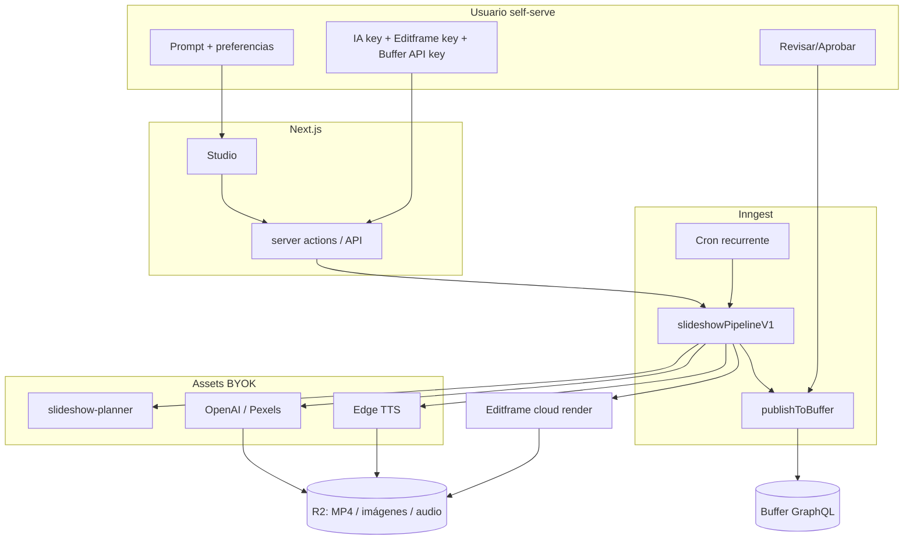

# Plan de producto — Fábrica de Contenido (self-serve)

> Objetivo: convertir esta base en un **producto final self-serve** donde **cualquier persona**
> pueda registrarse, conectar **su propia API key de IA** y **su cuenta de Buffer**, describir con
> un **prompt** qué quiere, y obtener **slideshows animados** para redes sociales que se **publican
> de forma agendada**. Una vez configurado, el sistema debe **generar y publicar contenido de forma
> recurrente y automática** usando el agente de IA y la cuenta de Buffer del propio usuario.

Este documento parte del **código que ya existe** en el repo y define el camino hasta el producto.
No estima días/semanas: describe componentes, archivos a tocar, dependencias y riesgos.

> **Decisión de motor de video: Editframe (no Remotion).** El render de los slideshows se hace en
> la **nube de Editframe** vía `@editframe/api`, con composiciones en **HTML + web components
> `ef-*`**. BYOK; **elimina la necesidad de GitHub Actions** para renderizar.
>
> **Decisión de publicación: Buffer API GraphQL (BYOK), no OAuth.** La API pública de Buffer migró
> a **GraphQL** (`https://api.buffer.com`) con **API key por usuario** (Bearer). El propio Buffer
> indica que *"OAuth para apps de terceros está por llegar"*, así que usamos **BYOK**: cada usuario
> pega su API key de Buffer y luego **sincroniza sus canales**.

---

## 1. Visión del producto

Una "fábrica de contenido" donde el usuario:

1. **Se registra** (Clerk).
2. **Trae sus propias llaves** (BYOK): IA (OpenAI/Anthropic/Gemini/OpenRouter), **Editframe**
   (render de video) y **Buffer** (publicar).
3. **Promptea** qué quiere en lenguaje natural.
4. **Obtiene slideshows animados** (texto animado + imágenes + voz en off) renderizados en Editframe.
5. **Agenda la publicación** en sus redes vía Buffer, con aprobación opcional.
6. **Automatiza**: define la frecuencia una vez y el sistema crea + publica solo, recurrentemente.

---

## 2. Estado actual (lo que YA existe)

- **App / stack**: Next.js 16, TS estricto, Tailwind 4, shadcn.
- **Auth**: Clerk; **DB multi-tenant**: Prisma + Postgres.
- **BYOK seguro**: AES-256-GCM; `EncryptedApiKey` por org.
- **IA**: OpenAI/Anthropic/Gemini/OpenRouter. **TTS**: Edge. **Orquestación**: Inngest. **Skills**: Zod.
- **Dashboard**: onboarding, studio, contenido, calendario, jobs, settings, admin, RBAC.

### Fase 1 — IMPLEMENTADA (núcleo de slideshow con Editframe)

- Skill `slideshow-planner`; `buildSlideshowHtml()`; servicio de render Editframe (BYOK);
  pipeline `slideshowPipelineV1`; BYOK `EDITFRAME`; Studio (prompt → preview → render).

### Fase 2 — IMPLEMENTADA (voz + imágenes)

- Voz Edge TTS por slide con duración real (`src/lib/tts/synthesize.ts`).
- Imágenes IA (OpenAI gpt-image-1) y stock (Pexels) (`src/lib/media/images.ts`).
- `ContentConfig` + `voiceover`, `voiceName`; controles en Studio.

### Fase 3 — IMPLEMENTADA (publicación con Buffer GraphQL)

- **Provider Buffer GraphQL** (`src/lib/publishing/providers/buffer.ts`): `getAccount`,
  `listChannels`, `createPost` (texto + **video** vía `assets:[{video:{url}}]` + `dueAt`),
  con manejo de errores tipados.
- **Sync de canales** (`src/lib/publishing/sync.ts`): `account → organizations → channels` →
  upsert en `SocialAccount` (platform `buffer`, `bufferId`=channelId); desactiva los que ya no existen.
- **Agenda real** (`src/lib/publishing/schedule.ts`): `computeNextScheduledAt()` calcula el próximo
  horario desde `ContentConfig.postingSchedule` (`["09:00", ...]` o `[{dayOfWeek,hour,minute}]`).
- **`publishToBuffer`** reescrito: publica **un post por canal**, adjunta el **MP4** (o imagen),
  programa con `dueAt`, registra `ScheduledPost` por canal y actualiza el estado del contenido.
- **Settings**: botón **"Sincronizar canales de Buffer"** + listado de canales conectados.
- **Onboarding/Ajustes**: la clave de Buffer ahora es la **API key** (Buffer → Settings → API).

---

## 3. Brechas restantes vs. la visión

| # | Brecha | Estado | Impacto |
|---|--------|--------|---------|
| G1 | Render real de slideshow animado | **Resuelto** (Editframe, Fase 1) | — |
| G2 | "prompt → guion de slides" | **Resuelto** (`slideshow-planner`, Fase 1) | — |
| G3 | Imágenes para las diapositivas | **Resuelto** (OpenAI / Pexels, Fase 2) | — |
| G4 | TTS integrado (voz en off) | **Resuelto** (Edge TTS por slide, Fase 2) | — |
| G6 | Buffer self-serve + API vigente + video | **Resuelto** (GraphQL BYOK + video, Fase 3) | — |
| G10 | Sync de canales de Buffer | **Resuelto** (Fase 3) | — |
| G5 | Automatización recurrente (cron) | Pendiente (Fase 4) | Bloqueante para "fábrica automática" |
| G7 | Onboarding "por prompt" | Parcial (Studio ya promptea) | Medio |
| G8 | Billing/planes y cuotas | Pendiente (Fase 6) | Medio |
| G9 | Preview animado en vivo (`@editframe/elements`) | Parcial (preview de guion) | Medio |

---

## 4. Arquitectura objetivo

Principios: BYOK por org; durabilidad con `step.run`/`step.sleep`; estado en
`ContentJob`/`VideoRender`/`ScheduledPost`/`SocialAccount`.

---

## 5. Roadmap por fases

Fases 1–4 = MVP. Fases 1, 2 y 3 ya están implementadas.

### Fase 1 — Núcleo de slideshow (Editframe) ✅
### Fase 2 — Voz + imágenes ✅
### Fase 3 — Publicación con Buffer (GraphQL, BYOK) ✅

Pendientes menores de pulido:
- Preview **animado en vivo** con `@editframe/elements`.
- Timezone real en la agenda (hoy se calcula en UTC; el campo `timezone` llega en Fase 4).
- Selección de **canales por contenido** desde la UI (hoy publica a todos los canales activos).
- Verificación de límites de Buffer por red/plan (tamaño y formato de video).

### Fase 4 — Automatización recurrente (G5) — "setear y olvidar"

1. **Función Inngest con cron** que dispara `content/slideshow.requested` según `postsPerDay` +
   `postingSchedule` + `timezone`, leyendo `imageSource`/`voiceover`/`voiceName` de `ContentConfig`.
   El render ya enlaza con `publishToBuffer` cuando `autoPost` está activo.
2. **Anti-duplicado y costo**: `ContentJob.idempotencyKey`; `UsageRecord`.
3. **Autopiloto** en `ContentConfig` (pausar/activar, "siguiente ejecución") + página de automatización.

### Fase 5 — Onboarding "por prompt" pleno (G7)
### Fase 6 — Negocio: planes, cuotas, observabilidad (G8)
### Fase 7 — Endurecimiento para producción

---

## 6. Cambios de datos (Prisma)

Aplicados:

- Fase 1 — `ApiKeyProvider`: + `EDITFRAME`; `ContentConfig`: + `prompt`, `slideCount`,
  `aspectRatio`, `imageSource`.
- Fase 2 — `ContentConfig`: + `voiceover`, `voiceName`.
- Fase 3 — sin cambios de esquema (se reutiliza `SocialAccount`: `bufferId`=channelId, `metadata.service`).

Sugeridos (Fase 4): `ContentConfig.timezone`, `nextRunAt`, `isAutopilotActive`.

> El repo usa `prisma db push` (schema-first). Tras pull: `npm run db:push` y `npm run db:seed`.

---

## 7. MVP recomendado (alcance mínimo vendible)

1. Registrarse → guardar API key de IA + **Editframe** + **Buffer** (+ opcional OpenAI/Pexels) →
   **sincronizar canales de Buffer** → escribir un prompt.
2. Generar **un slideshow animado con voz e imágenes** (Editframe → MP4 en R2). ✅ vía Studio.
3. **Preview** del guion y **aprobar**.
4. **Publicar/agendar** en Buffer (un post por canal, con el MP4). ✅ Fase 3.
5. **Activar autopiloto** (cron) para repetir automáticamente (Fase 4).

---

## 8. Riesgos y decisiones abiertas

- **Buffer**: OAuth para terceros aún no existe; usamos **API key BYOK**. La API GraphQL **no acepta
  subida de archivos**: el video/imagen debe estar en una **URL pública** (R2). Validar límites de
  tamaño/formato por red (Instagram 300MB, etc.).
- **Editframe (BYOK)**: costo/límites de render a cargo del usuario.
- **Imágenes IA**: requieren R2 para hostear; costo del usuario (OpenAI). **Pexels**: respetar licencias.
- **Voz**: Edge TTS gratis pero no oficial; evaluar alternativa de pago para producción.
- **Multi-tenant**: rate limiting y cuotas por plan desde el autopiloto.

---

## 9. Próximos pasos concretos

1. Probar Fases 1–3 end-to-end con llaves reales (IA + Editframe + Buffer; R2 para media).
2. Fase 4: **cron** de autopiloto para la fábrica automática (generación + publicación recurrentes).
3. Fase 6: billing y cuotas para comercializar.
