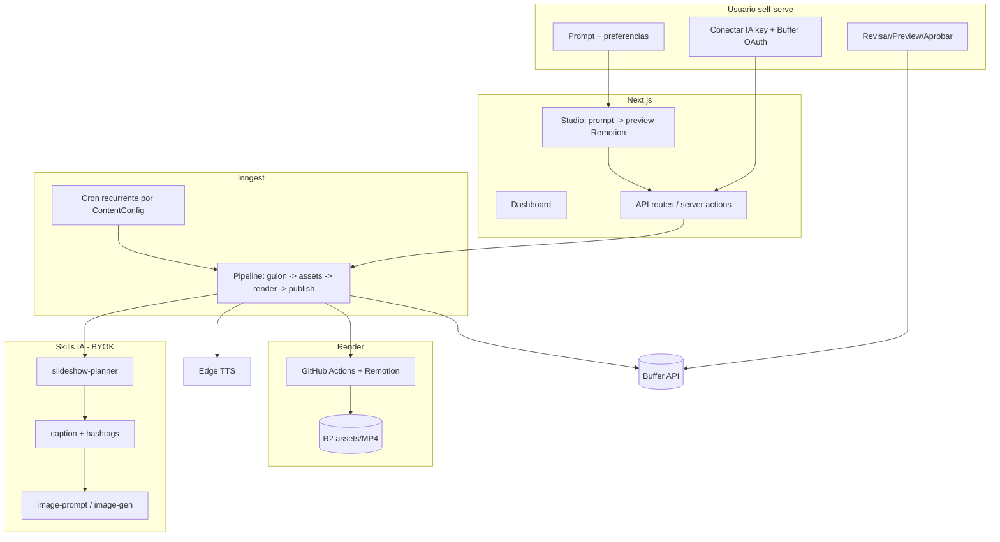

# Plan de producto — Fábrica de Contenido (self-serve)

> Objetivo: convertir esta base en un **producto final self-serve** donde **cualquier persona**
> pueda registrarse, conectar **su propia API key de IA** y **su cuenta de Buffer**, describir con
> un **prompt** qué quiere, y obtener **slideshows animados** para redes sociales que se **publican
> de forma agendada**. Una vez configurado, el sistema debe **generar y publicar contenido de forma
> recurrente y automática** usando el agente de IA y la cuenta de Buffer del propio usuario.

Este documento parte del **código que ya existe** en el repo y define el camino hasta el producto.
No estima días/semanas: describe componentes, archivos a tocar, dependencias y riesgos.

---

## 1. Visión del producto

Una "fábrica de contenido" donde el usuario:

1. **Se registra** (ya soportado con Clerk).
2. **Trae sus propias llaves** (BYOK): API key de un proveedor de IA (OpenAI/Anthropic/Gemini/OpenRouter)
   y conexión con **Buffer** para publicar.
3. **Promptea**: escribe en lenguaje natural qué tipo de contenido quiere ("slideshows educativos
   sobre finanzas personales, tono cercano, 3 por semana para Instagram y TikTok").
4. **Obtiene slideshows animados** (video vertical 9:16 con varias diapositivas, texto animado,
   imágenes y voz en off) generados automáticamente.
5. **Agenda la publicación** en sus redes vía Buffer, con aprobación opcional.
6. **Automatiza**: define la frecuencia una vez y el sistema sigue creando + publicando solo,
   de forma recurrente, sin que el usuario tenga que volver a promptear.

El diferenciador clave frente al estado actual: hoy el pipeline solo genera **textos ("hooks")**.
El producto requiere **video/slideshow real** + **automatización recurrente** + **conexión Buffer
self-serve**.

---

## 2. Estado actual (lo que YA existe)

Cimientos sólidos ya implementados:

- **App / stack**: Next.js 16 (App Router), TS estricto, Tailwind 4, shadcn (`src/app`, `src/components`).
- **Auth**: Clerk con middleware y rutas `/login`, `/sign-up` (`src/middleware.ts`).
- **DB multi-tenant**: Prisma + Postgres con un esquema muy completo (`prisma/schema.prisma`):
  `Organization`, `OrganizationMember`, `EncryptedApiKey`, `SocialAccount`, `ContentConfig`,
  `Workflow`, `ContentJob`, `GeneratedContent`, `VideoRender`, `ScheduledPost`, `SkillDefinition`,
  `SkillExecution`, `AuditLog`, `UsageRecord`, `WebhookEndpoint`.
- **BYOK seguro**: cifrado AES-256-GCM (`src/lib/encryption/cipher.ts`), almacenamiento por org
  con `EncryptedApiKey` y rotación/fingerprint (`src/services/api-keys.ts`).
- **Adaptadores de IA**: OpenAI, Anthropic, Gemini, OpenRouter con `generateJSON` (`src/lib/ai/`).
- **TTS gratuito**: `edge-tts-universal` (`src/lib/tts/providers/edge.ts`) — devuelve audio + subtítulos.
- **Publicación Buffer**: provider con `schedulePost` / `publishPost` (`src/lib/publishing/providers/buffer.ts`).
- **Orquestación**: Inngest con `contentPipelineV1` y `publishToBuffer` (`src/lib/inngest/functions.ts`).
- **Skills**: registro + ejecutor con Zod (`src/skills/`), pero solo existe `hook-generator`.
- **Video (scaffold)**: dispatch a GitHub Actions (`src/lib/video/github-actions.ts`) +
  workflow placeholder (`.github/workflows/render-video.yml`) + storage R2 (`src/lib/storage/r2.ts`).
- **Dashboard**: onboarding (4 pasos), contenido (cola de aprobación), calendario, jobs, settings,
  admin, RBAC (`src/lib/auth/`), audit logs.

---

## 3. Brechas vs. la visión (lo que FALTA)

| # | Brecha | Evidencia en el repo | Impacto |
|---|--------|----------------------|---------|
| G1 | **No hay render real de slideshow animado** | `.github/workflows/render-video.yml` es un placeholder con `echo`; no existe carpeta `remotion/` ni composiciones | **Bloqueante**: es el core del producto |
| G2 | **No hay "prompt → guion de slides"** | Único skill es `hook-generator` (genera textos sueltos) | **Bloqueante**: no se puede crear un slideshow desde un prompt |
| G3 | **No hay generación/obtención de imágenes** para las diapositivas | No hay skill ni servicio de imágenes/stock | Alto |
| G4 | **TTS no está integrado** al pipeline | `edge.ts` existe pero el pipeline nunca lo invoca | Alto (voz en off) |
| G5 | **No hay automatización recurrente** | `requestPipelineRun` es manual; `postingSchedule` no se consume; no hay cron Inngest | **Bloqueante** para "fábrica automática" |
| G6 | **Buffer es solo token pegado a mano + API legacy** | Onboarding pide token/profileId manual; `buffer.ts` usa `api.bufferapp.com/1` (legacy) | Alto (UX + viabilidad) |
| G7 | **El "prompt" no existe como UX** | Onboarding solo pide tono/temas en campos sueltos; `@remotion/player` está en deps pero sin usar | Alto |
| G8 | **No hay billing/planes ni límites** | Enum `Plan` y `UsageRecord` existen pero sin Stripe ni cuotas | Medio (negocio) |
| G9 | **No hay preview del slideshow** antes de publicar | No se usa `@remotion/player` en ninguna página | Medio |
| G10 | **Falta sincronizar perfiles de Buffer** automáticamente | `SocialAccount` se crea a mano en onboarding | Medio |

---

## 4. Arquitectura objetivo

Principios:

- **BYOK por org**: toda la IA y publicación usa las llaves del propio usuario (ya soportado por
  `EncryptedApiKey` + `getActiveAiProviderForOrg` + `getBufferAccessTokenForOrg`).
- **Durabilidad**: cada paso es un `step.run` de Inngest, idempotente y reintentable; el estado vive
  en `ContentJob` / `VideoRender` / `ScheduledPost`.
- **Costo cercano a cero por defecto**: render en minutos gratis de GitHub Actions, TTS gratis con
  Edge, IA pagada por el usuario.

---

## 5. Roadmap por fases

Cada fase entrega valor verificable. Las fases 1–4 forman el **MVP**.

### Fase 0 — Higiene y base de pruebas (habilitador)

- Añadir `.env.example` (hoy no existe; el README lo referencia) con todas las vars de
  `src/config/env.server.ts`.
- Documentar y validar variables de render (`GITHUB_*`, `R2_*`, `VIDEO_WEBHOOK_SECRET`).
- Tests mínimos del cifrado, del executor de skills y del parseo de guion.

### Fase 1 — Núcleo de slideshow (G1, G2, G9) — **el corazón del MVP**

1. **Skill `slideshow-planner`** (`src/skills/slideshow-planner/skill.ts`):
   - Input (Zod): `prompt`, `platform`, `tone`, `targetAudience`, `slideCount`, `aspectRatio`.
   - Output (Zod): `{ title, slides: [{ heading, body, voiceover, imagePrompt, durationMs }],
     caption, hashtags[] }`.
   - Usa `ctx.ai.generateJSON` (igual que `hook-generator`).
2. **Composición Remotion** en nueva carpeta `remotion/`:
   - `remotion/Root.tsx` registra `<Composition id="Slideshow" ... />` 9:16 (1080×1920).
   - `remotion/Slideshow.tsx`: recibe `props = { slides, brand, audioUrl }`; anima entrada/salida
     de cada slide (fade/slide/scale con `interpolate` + `spring`), muestra heading/body, imagen de
     fondo y barra de progreso; sincroniza duración con el audio TTS.
   - Esquema de props con `zod` para validación en CLI.
3. **Preview en la app** (G9): nueva página `src/app/dashboard/studio/page.tsx` que usa
   `@remotion/player` (`<Player>`) para previsualizar el slideshow generado **antes** de renderizar
   en alta calidad. Reutiliza la misma composición.
4. **Render real** (G1): reescribir `.github/workflows/render-video.yml`:
   - Descargar props/assets del `client_payload` (o de un JSON en R2 por `jobId`).
   - `npx remotion render remotion/Root.tsx Slideshow out.mp4 --props=props.json`.
   - Subir MP4 a R2; `POST` al `webhookUrl` con `x-fabrica-webhook-secret` (ya validado en
     `src/app/api/webhooks/video-complete/route.ts`).

### Fase 2 — Assets: imágenes + voz (G3, G4)

1. **Voz en off (G4)**: invocar `EdgeTTSProvider` en el pipeline por slide o por guion completo,
   subir el audio a R2 (`src/lib/storage/r2.ts`) y pasar `audioUrl` a la composición. Usar los
   `subtitle`/word boundaries para temporizar las slides.
2. **Imágenes (G3)**:
   - Opción A (BYOK imágenes): si la org tiene key de un proveedor con imágenes (p. ej. OpenAI
     `gpt-image-1`), generar imágenes desde `imagePrompt`.
   - Opción B (gratis): integrar stock libre (Pexels/Unsplash API) como fallback sin costo de IA.
   - Guardar URLs en `GeneratedContent.mediaUrls` y en `VideoRender.assetUrls`.
3. Extender `ApiKeyProvider`/config para declarar qué proveedor de imágenes usa cada org.

### Fase 3 — Conexión Buffer self-serve y publicación (G6, G10)

1. **Buffer OAuth** en lugar de token pegado a mano:
   - Ruta `src/app/api/oauth/buffer/route.ts` (inicio) y `.../callback/route.ts` (intercambio de
     code → access_token), guardando el token cifrado en `EncryptedApiKey(provider=BUFFER)`.
   - Tras conectar, **sincronizar perfiles** de Buffer hacia `SocialAccount` (G10) en vez de pedir
     `profileId` manual.
   - Revisar el endpoint/host de la API de Buffer vigente y actualizar `buffer.ts` (hoy usa el host
     legacy `api.bufferapp.com/1`); validar que el plan de Buffer del usuario permite video.
2. **Publicación de video**: en `publishToBuffer`, adjuntar `videoUrl` (MP4 en R2) como media.
   Manejar el caso de plataformas que no aceptan el formato (validación + error claro).
3. **Agenda real**: usar `ContentConfig.postingSchedule` (franjas horarias) para calcular
   `scheduledFor` en vez del hardcode actual (`Date.now() + 1h` en `functions.ts`).

### Fase 4 — Automatización recurrente (G5) — **"setear y olvidar"**

1. **Función Inngest con cron** (`src/lib/inngest/functions.ts`): `inngest.createFunction` con
   `{ cron: "..." }` que cada hora revise `ContentConfig` activas y, según `postsPerDay` +
   `postingSchedule` + zona horaria, dispare `content/pipeline.requested` para las orgs que toca.
2. **Anti-duplicado y control de costo**: usar `ContentJob.idempotencyKey` (ya existe, `@unique`)
   por `(orgId, configId, ventana)`; registrar consumo en `UsageRecord`.
3. **Estados del autopiloto** en `ContentConfig`: pausar/activar, "siguiente ejecución", límites por
   plan. UI en una nueva página `src/app/dashboard/automation/page.tsx`.
4. **Aprobación opcional**: si `requireApproval`, el contenido queda en `PENDING_APPROVAL` y solo se
   publica tras aprobar (flujo ya parcialmente implementado en `actions.ts`).

### Fase 5 — Onboarding "por prompt" y Studio (G7)

1. Rediseñar el wizard (`src/app/dashboard/onboarding/onboarding-wizard.tsx`) para que el paso
   central sea **un prompt grande** ("describe tu fábrica de contenido") del que se deriven
   `topics`, `tone`, `targetAudience`, `platforms`, `postsPerDay` (usando un skill que estructura el
   prompt en `ContentConfig`).
2. **Studio interactivo**: el usuario promptea, ve el preview Remotion, ajusta y guarda como plantilla
   recurrente.

### Fase 6 — Negocio: planes, cuotas y observabilidad (G8)

1. **Stripe** + mapeo a enum `Plan`; webhooks → actualizar `Organization.plan`.
2. **Cuotas por plan**: límites de slideshows/mes, validados con `UsageRecord` y `@upstash/ratelimit`
   (ya en deps).
3. **Observabilidad**: panel de jobs (existe `dashboard/jobs`), alertas de fallos, dead-letter
   (parcial), métricas de render y publicación.

### Fase 7 — Endurecimiento para producción

- Rate limiting de acciones sensibles, validación de webhooks (Buffer/Clerk/video), reintentos con
  backoff, DLQ, observabilidad de costos de IA por org.
- Cumplimiento: política de privacidad/manejo de llaves (ya cifradas), borrado de datos por org,
  términos de uso de las APIs de terceros (Buffer, proveedores de IA, stock de imágenes).
- Escalado: Remotion Lambda como alternativa a GitHub Actions si crece el volumen; particionado de
  `UsageRecord`/`AuditLog`; read replicas / Prisma Accelerate.

---

## 6. Cambios de datos sugeridos (Prisma)

El esquema ya cubre casi todo. Cambios incrementales recomendados:

- `ContentConfig`: añadir `prompt String?` (prompt maestro), `timezone String?`,
  `nextRunAt DateTime?`, `isAutopilotActive Boolean @default(false)`,
  `imageSource String?` (`"ai" | "pexels" | "none"`), `slideCount Int @default(5)`,
  `aspectRatio String @default("9:16")`.
- `ApiKeyProvider`: opcionalmente añadir proveedor(es) de imágenes/stock si se usan llaves dedicadas.
- `GeneratedContent`: ya tiene `mediaUrls`, `videoUrl`, `thumbnailUrl` — suficiente.
- Confirmar que `ScheduledPost.scheduledFor` se llene desde `postingSchedule` real.

Todos los cambios vía `prisma migrate` (no romper datos existentes).

---

## 7. MVP recomendado (alcance mínimo vendible)

Para validar el producto end-to-end con un usuario real:

1. Onboarding: registrarse → guardar **una** API key de IA → conectar Buffer (OAuth o token) →
   escribir **un prompt**.
2. Generar **un slideshow animado** (skill `slideshow-planner` → Remotion → MP4 en R2) con voz Edge.
3. **Preview** en el dashboard y **aprobar**.
4. **Agendar/publicar** en Buffer.
5. **Activar autopiloto** (cron) para que repita N veces por semana automáticamente.

Esto corresponde a **Fases 1–4** (+ partes de la 5). Las fases 6–7 hacen el producto comercial y
robusto, pero no son necesarias para la primera demo funcional.

---

## 8. Riesgos y decisiones abiertas

- **Buffer**: validar disponibilidad de OAuth/API vigente y soporte de **video** en el plan del
  usuario. Si Buffer limita video, considerar publicación directa por red (Instagram Graph API,
  TikTok API) como alternativa o complemento. Decisión de producto pendiente.
- **Costo/limites de GitHub Actions** para render: minutos gratuitos son finitos; con volumen alto,
  migrar a Remotion Lambda o runners propios.
- **Calidad del slideshow**: la animación con Remotion es totalmente programable; definir 2–3
  plantillas iniciales (lista, cita, paso a paso) para acotar alcance.
- **Costo de IA del usuario**: como es BYOK, el costo lo asume el usuario; mostrar estimaciones y
  límites para evitar sorpresas.
- **Imágenes con derechos**: si se usa stock, respetar licencias; si se generan con IA, respetar
  términos del proveedor.
- **Abuso/multi-tenant**: rate limiting y cuotas por plan desde el inicio del autopiloto.

---

## 9. Próximos pasos concretos

1. Aprobar este plan y el alcance del MVP (Fases 1–4).
2. Empezar por la **Fase 1** (skill `slideshow-planner` + composición Remotion + preview + workflow
   de render real), que desbloquea la propuesta de valor.
3. Crear `.env.example` y la migración de `ContentConfig` (Sección 6) como primer PR de habilitación.
