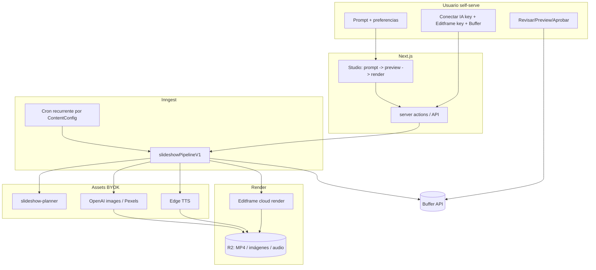

# Plan de producto — Fábrica de Contenido (self-serve)

> Objetivo: convertir esta base en un **producto final self-serve** donde **cualquier persona**
> pueda registrarse, conectar **su propia API key de IA** y **su cuenta de Buffer**, describir con
> un **prompt** qué quiere, y obtener **slideshows animados** para redes sociales que se **publican
> de forma agendada**. Una vez configurado, el sistema debe **generar y publicar contenido de forma
> recurrente y automática** usando el agente de IA y la cuenta de Buffer del propio usuario.

Este documento parte del **código que ya existe** en el repo y define el camino hasta el producto.
No estima días/semanas: describe componentes, archivos a tocar, dependencias y riesgos.

> **Decisión de motor de video: Editframe (no Remotion).** El render de los slideshows se hace en
> la **nube de Editframe** vía `@editframe/api`, con composiciones en **HTML + web components
> `ef-*`**. Esto encaja con BYOK (cada usuario trae su propia API key de Editframe) y **elimina la
> necesidad de GitHub Actions** para renderizar.

---

## 1. Visión del producto

Una "fábrica de contenido" donde el usuario:

1. **Se registra** (ya soportado con Clerk).
2. **Trae sus propias llaves** (BYOK): API key de un proveedor de IA (OpenAI/Anthropic/Gemini/OpenRouter),
   API key de **Editframe** (render de video) y conexión con **Buffer** para publicar.
3. **Promptea**: escribe en lenguaje natural qué tipo de contenido quiere ("slideshows educativos
   sobre finanzas personales, tono cercano, 3 por semana para Instagram y TikTok").
4. **Obtiene slideshows animados** (video vertical 9:16 con varias diapositivas, texto animado,
   imágenes y voz en off) renderizados en la nube de Editframe.
5. **Agenda la publicación** en sus redes vía Buffer, con aprobación opcional.
6. **Automatiza**: define la frecuencia una vez y el sistema sigue creando + publicando solo,
   de forma recurrente, sin que el usuario tenga que volver a promptear.

---

## 2. Estado actual (lo que YA existe)

Cimientos sólidos ya implementados:

- **App / stack**: Next.js 16 (App Router), TS estricto, Tailwind 4, shadcn.
- **Auth**: Clerk con middleware y rutas `/login`, `/sign-up`.
- **DB multi-tenant**: Prisma + Postgres (`prisma/schema.prisma`).
- **BYOK seguro**: cifrado AES-256-GCM; `EncryptedApiKey` por org (`src/services/api-keys.ts`).
- **Adaptadores de IA**: OpenAI, Anthropic, Gemini, OpenRouter (`src/lib/ai/`).
- **TTS gratuito**: `edge-tts-universal` (`src/lib/tts/`).
- **Publicación Buffer**: provider (`src/lib/publishing/providers/buffer.ts`).
- **Orquestación**: Inngest (`src/lib/inngest/functions.ts`).
- **Skills**: registro + ejecutor con Zod (`src/skills/`).
- **Dashboard**: onboarding, studio, contenido, calendario, jobs, settings, admin, RBAC.

### Fase 1 — IMPLEMENTADA (núcleo de slideshow con Editframe)

- **Skill `slideshow-planner`**: prompt → guion `{ title, slides[], caption, hashtags[] }`.
- **Composición** `buildSlideshowHtml()` (`src/lib/video/editframe-composition.ts`): HTML con
  `ef-*` + animaciones; dimensiones por `aspectRatio`.
- **Servicio de render Editframe** (`src/lib/video/editframe.ts`, BYOK).
- **Pipeline durable** `slideshowPipelineV1` (`content/slideshow.requested`): planner → HTML →
  render → R2 → `VideoRender`/`GeneratedContent`.
- **BYOK Editframe** (`EDITFRAME`), alta de clave en Onboarding/Ajustes.
- **Studio** (`src/app/dashboard/studio/`): prompt → preview del guion → render.

### Fase 2 — IMPLEMENTADA (voz + imágenes)

- **Voz en off (Edge TTS)** (`src/lib/tts/synthesize.ts`): `synthesizeVoice()` calcula la duración
  real desde los *word boundaries*; el pipeline genera **un clip por slide**, lo sube a R2 y **ajusta
  la duración de cada slide** a su narración. La composición inserta un `<ef-audio>` por slide.
- **Imágenes** (`src/lib/media/images.ts`):
  - **IA**: `generateImageWithOpenAI()` (gpt-image-1) con la **OpenAI key del propio tenant**;
    la imagen se sube a R2 y se usa como fondo del slide.
  - **Stock**: `searchPexelsImageUrl()` (Pexels, key de plataforma opcional `PEXELS_API_KEY`).
  - Las URLs se guardan en `GeneratedContent.mediaUrls` y se pasan como fondos a la composición.
- **Datos**: `ContentConfig` + `voiceover`, `voiceName` (y `imageSource` de Fase 1).
- **Studio**: selección de **fuente de imágenes**, **voz** (catálogo Edge) y toggle de **voz en off**;
  se propagan al evento de render.
- **Voces** reutilizables en cliente (`src/lib/tts/voices.ts`).

---

## 3. Brechas restantes vs. la visión

| # | Brecha | Estado | Impacto |
|---|--------|--------|---------|
| G1 | Render real de slideshow animado | **Resuelto** (Editframe, Fase 1) | — |
| G2 | "prompt → guion de slides" | **Resuelto** (`slideshow-planner`, Fase 1) | — |
| G3 | Imágenes para las diapositivas | **Resuelto** (OpenAI / Pexels, Fase 2) | — |
| G4 | TTS integrado al pipeline (voz en off) | **Resuelto** (Edge TTS por slide, Fase 2) | — |
| G5 | Automatización recurrente (cron) | Pendiente (Fase 4) | Bloqueante para "fábrica automática" |
| G6 | Buffer self-serve (OAuth) + API vigente + video | Pendiente (Fase 3) | Alto |
| G7 | Onboarding "por prompt" | Parcial (Studio ya promptea) | Medio |
| G8 | Billing/planes y cuotas | Pendiente (Fase 6) | Medio |
| G9 | Preview animado en vivo dentro de la app | Parcial (preview de guion; falta `@editframe/elements`) | Medio |
| G10 | Sync automático de perfiles de Buffer | Pendiente (Fase 3) | Medio |

---

## 4. Arquitectura objetivo

Principios: BYOK por org (IA, Editframe, imágenes y publicación con llaves del usuario);
durabilidad con `step.run`/`step.sleep` de Inngest; estado en `ContentJob`/`VideoRender`/`ScheduledPost`.

---

## 5. Roadmap por fases

Las fases 1–4 forman el **MVP**. Fases 1 y 2 ya están implementadas.

### Fase 1 — Núcleo de slideshow (Editframe) ✅
### Fase 2 — Voz + imágenes ✅

Pendientes menores de pulido (post-Fase 2):
- Preview **animado en vivo** en la app con `@editframe/elements` (hoy se muestra el guion).
- Música de fondo opcional y mezcla con la voz; subtítulos quemados desde los word boundaries.
- Caché/deduplicación de imágenes y audio por `(prompt, voz)` para ahorrar costo.

### Fase 3 — Conexión Buffer self-serve y publicación (G6, G10)

1. **Buffer OAuth** (`src/app/api/oauth/buffer/...`) con token cifrado; **sync de perfiles** hacia
   `SocialAccount`. Revisar host/endpoint vigente de Buffer y soporte de **video** según plan.
2. **Publicar el MP4** (R2) como media en `publishToBuffer`.
3. **Agenda real**: usar `ContentConfig.postingSchedule` para `scheduledFor`.

### Fase 4 — Automatización recurrente (G5) — "setear y olvidar"

1. **Función Inngest con cron** que dispara `content/slideshow.requested` según `postsPerDay` +
   `postingSchedule` + timezone, leyendo `imageSource`/`voiceover`/`voiceName` de `ContentConfig`.
2. **Anti-duplicado y costo**: `ContentJob.idempotencyKey`; `UsageRecord`.
3. **Autopiloto** en `ContentConfig` (pausar/activar, "siguiente ejecución") + página de automatización.

### Fase 5 — Onboarding "por prompt" pleno (G7)
### Fase 6 — Negocio: planes, cuotas, observabilidad (G8)
### Fase 7 — Endurecimiento para producción

---

## 6. Cambios de datos (Prisma)

Aplicados:

- Fase 1 — `ApiKeyProvider`: + `EDITFRAME`; `ContentConfig`: + `prompt`, `slideCount`,
  `aspectRatio`, `imageSource`.
- Fase 2 — `ContentConfig`: + `voiceover`, `voiceName`.

Sugeridos (Fase 4): `ContentConfig.timezone`, `nextRunAt`, `isAutopilotActive`.

> El repo usa `prisma db push` (schema-first, sin historial de migraciones). Tras pull:
> `npm run db:push` y `npm run db:seed`.

---

## 7. MVP recomendado (alcance mínimo vendible)

1. Registrarse → guardar API key de IA + **Editframe** (+ opcional OpenAI/Pexels para imágenes) →
   conectar Buffer → escribir **un prompt**.
2. Generar **un slideshow animado con voz e imágenes** (Editframe → MP4 en R2). ✅ vía Studio.
3. **Preview** del guion y **aprobar**.
4. **Agendar/publicar** en Buffer (Fase 3).
5. **Activar autopiloto** (cron) para repetir automáticamente (Fase 4).

---

## 8. Riesgos y decisiones abiertas

- **Editframe (BYOK)**: costo/límites de render los asume el usuario; mostrar estado/errores claros.
- **Imágenes IA**: requieren R2 para hostear el resultado; costo a cargo del usuario (OpenAI).
- **Pexels**: respetar licencias de uso; key de plataforma opcional.
- **Voz**: Edge TTS es gratis pero no oficial; evaluar alternativa de pago para producción.
- **Buffer**: validar OAuth/API vigente y soporte de video; alternativa: publicar directo por red.
- **Abuso/multi-tenant**: rate limiting y cuotas por plan desde el autopiloto.

---

## 9. Próximos pasos concretos

1. Probar Fases 1–2 end-to-end con llaves reales (IA + Editframe; opcional OpenAI/Pexels; R2 para
   imágenes y voz).
2. Fase 3: **Buffer OAuth** + publicación del MP4 + agenda real.
3. Fase 4: **cron** de autopiloto para la fábrica automática.
