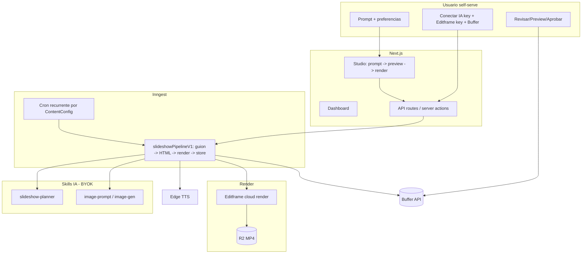

# Plan de producto — Fábrica de Contenido (self-serve)

> Objetivo: convertir esta base en un **producto final self-serve** donde **cualquier persona**
> pueda registrarse, conectar **su propia API key de IA** y **su cuenta de Buffer**, describir con
> un **prompt** qué quiere, y obtener **slideshows animados** para redes sociales que se **publican
> de forma agendada**. Una vez configurado, el sistema debe **generar y publicar contenido de forma
> recurrente y automática** usando el agente de IA y la cuenta de Buffer del propio usuario.

Este documento parte del **código que ya existe** en el repo y define el camino hasta el producto.
No estima días/semanas: describe componentes, archivos a tocar, dependencias y riesgos.

> **Decisión de motor de video: Editframe (no Remotion).** El render de los slideshows se hace en
> la **nube de Editframe** vía `@editframe/api`, con composiciones en **HTML + web components
> `ef-*`**. Esto encaja con BYOK (cada usuario trae su propia API key de Editframe) y **elimina la
> necesidad de GitHub Actions** para renderizar.

---

## 1. Visión del producto

Una "fábrica de contenido" donde el usuario:

1. **Se registra** (ya soportado con Clerk).
2. **Trae sus propias llaves** (BYOK): API key de un proveedor de IA (OpenAI/Anthropic/Gemini/OpenRouter),
   API key de **Editframe** (render de video) y conexión con **Buffer** para publicar.
3. **Promptea**: escribe en lenguaje natural qué tipo de contenido quiere ("slideshows educativos
   sobre finanzas personales, tono cercano, 3 por semana para Instagram y TikTok").
4. **Obtiene slideshows animados** (video vertical 9:16 con varias diapositivas, texto animado,
   imágenes y voz en off) renderizados en la nube de Editframe.
5. **Agenda la publicación** en sus redes vía Buffer, con aprobación opcional.
6. **Automatiza**: define la frecuencia una vez y el sistema sigue creando + publicando solo,
   de forma recurrente, sin que el usuario tenga que volver a promptear.

El diferenciador clave frente al estado inicial: el pipeline base solo generaba **textos ("hooks")**.
El producto requiere **video/slideshow real** + **automatización recurrente** + **conexión Buffer
self-serve**.

---

## 2. Estado actual (lo que YA existe)

Cimientos sólidos ya implementados:

- **App / stack**: Next.js 16 (App Router), TS estricto, Tailwind 4, shadcn (`src/app`, `src/components`).
- **Auth**: Clerk con middleware y rutas `/login`, `/sign-up` (`src/middleware.ts`).
- **DB multi-tenant**: Prisma + Postgres con un esquema muy completo (`prisma/schema.prisma`).
- **BYOK seguro**: cifrado AES-256-GCM (`src/lib/encryption/cipher.ts`), almacenamiento por org
  con `EncryptedApiKey` y rotación/fingerprint (`src/services/api-keys.ts`).
- **Adaptadores de IA**: OpenAI, Anthropic, Gemini, OpenRouter con `generateJSON` (`src/lib/ai/`).
- **TTS gratuito**: `edge-tts-universal` (`src/lib/tts/providers/edge.ts`).
- **Publicación Buffer**: provider con `schedulePost` / `publishPost` (`src/lib/publishing/providers/buffer.ts`).
- **Orquestación**: Inngest (`src/lib/inngest/functions.ts`).
- **Skills**: registro + ejecutor con Zod (`src/skills/`).
- **Dashboard**: onboarding, contenido, calendario, jobs, settings, admin, RBAC, audit logs.

### Fase 1 — YA IMPLEMENTADA en este PR (núcleo de slideshow con Editframe)

- **Skill `slideshow-planner`** (`src/skills/slideshow-planner/skill.ts`): convierte un **prompt**
  en un guion estructurado `{ title, slides[], caption, hashtags[] }` usando la IA del propio tenant.
- **Generador de composición** (`src/lib/video/editframe-composition.ts`): función pura
  `buildSlideshowHtml(plan, opts)` que produce el **HTML con web components `ef-*`** (animaciones
  fade/ken-burns/barra de progreso) y resuelve dimensiones por `aspectRatio`.
- **Servicio de render Editframe** (`src/lib/video/editframe.ts`): `startEditframeRender`,
  `getEditframeRenderStatus`, `waitForEditframeRender`, `downloadEditframeRender` (BYOK).
- **Pipeline durable** `slideshowPipelineV1` (`src/lib/inngest/functions.ts`): prompt → planner →
  HTML → render Editframe (con polling vía `step.sleep`) → descarga MP4 → sube a **R2** → actualiza
  `VideoRender` + `GeneratedContent`. Disparado por el evento `content/slideshow.requested`.
- **BYOK Editframe**: nuevo valor `EDITFRAME` en `ApiKeyProvider`; alta de clave en **Onboarding**
  y **Ajustes**; helper `getEditframeApiKeyForOrg`.
- **Studio** (`src/app/dashboard/studio/`): UI de **prompt → preview del guion → renderizar**.
- **Datos**: `ContentConfig` extendido con `prompt`, `slideCount`, `aspectRatio`, `imageSource`.
- **`.env.example`** creado con todas las variables.

---

## 3. Brechas restantes vs. la visión

| # | Brecha | Estado | Impacto |
|---|--------|--------|---------|
| G1 | Render real de slideshow animado | **Resuelto** (Editframe en Fase 1) | — |
| G2 | "prompt → guion de slides" | **Resuelto** (`slideshow-planner`) | — |
| G3 | Generación/obtención de imágenes para las diapositivas | Pendiente (Fase 2) | Alto |
| G4 | TTS integrado al pipeline (voz en off) | Pendiente (Fase 2) | Alto |
| G5 | Automatización recurrente (cron) | Pendiente (Fase 4) | Bloqueante para "fábrica automática" |
| G6 | Buffer self-serve (OAuth) + API vigente + video | Pendiente (Fase 3) | Alto |
| G7 | Onboarding "por prompt" | Parcial (Studio ya promptea) | Medio |
| G8 | Billing/planes y cuotas | Pendiente (Fase 6) | Medio |
| G9 | Preview animado en vivo dentro de la app | Parcial (preview de guion; falta `@editframe/elements`) | Medio |
| G10 | Sync automático de perfiles de Buffer | Pendiente (Fase 3) | Medio |

---

## 4. Arquitectura objetivo

Principios:

- **BYOK por org**: IA, Editframe y publicación usan las llaves del propio usuario.
- **Durabilidad**: cada paso es un `step.run` de Inngest, idempotente y reintentable; el estado vive
  en `ContentJob` / `VideoRender` / `ScheduledPost`.
- **Costo cercano a cero por defecto para la plataforma**: render e IA los paga el usuario (BYOK);
  TTS gratis con Edge.

---

## 5. Roadmap por fases

Las fases 1–4 forman el **MVP**. La Fase 1 ya está implementada.

### Fase 1 — Núcleo de slideshow (Editframe) ✅ implementada

Ver Sección 2 ("Fase 1 — YA IMPLEMENTADA").

Pendientes menores de pulido:
- Preview **animado en vivo** dentro de la app con `@editframe/elements` (hoy se muestra el guion).
- Manejo de cuotas/errores de Editframe más detallado en la UI.

### Fase 2 — Assets: imágenes + voz (G3, G4)

1. **Voz en off (G4)**: invocar `EdgeTTSProvider` por slide o por guion, subir el audio a R2 y
   pasar `audioUrl` a `buildSlideshowHtml` (ya soporta `ef-audio` opcional). Usar los word
   boundaries para temporizar las slides.
2. **Imágenes (G3)**:
   - Opción A (BYOK imágenes): si la org tiene key con imágenes (p. ej. OpenAI `gpt-image-1`),
     generar desde `imagePrompt` de cada slide.
   - Opción B (gratis): integrar stock libre (Pexels/Unsplash) como fallback.
   - Pasar las URLs como `fallbackImageUrls` a la composición y guardarlas en `GeneratedContent.mediaUrls`.

### Fase 3 — Conexión Buffer self-serve y publicación (G6, G10)

1. **Buffer OAuth** (rutas `src/app/api/oauth/buffer/...`) guardando token cifrado; **sync de
   perfiles** hacia `SocialAccount`. Revisar el host/endpoint de la API de Buffer vigente
   (`buffer.ts` usa el host legacy) y soporte de **video** según el plan del usuario.
2. **Publicar el MP4**: adjuntar `videoUrl` (R2) como media en `publishToBuffer`.
3. **Agenda real**: usar `ContentConfig.postingSchedule` para calcular `scheduledFor`
   (hoy hay un `+1h` hardcodeado en `functions.ts`).

### Fase 4 — Automatización recurrente (G5) — "setear y olvidar"

1. **Función Inngest con cron**: revisa `ContentConfig` activas y dispara
   `content/slideshow.requested` según `postsPerDay` + `postingSchedule` + timezone.
2. **Anti-duplicado y costo**: `ContentJob.idempotencyKey` por `(orgId, configId, ventana)`;
   registrar consumo en `UsageRecord`.
3. **Autopiloto** en `ContentConfig` (pausar/activar, "siguiente ejecución") + página
   `src/app/dashboard/automation/page.tsx`.

### Fase 5 — Onboarding "por prompt" pleno (G7)

Derivar `topics`, `tone`, `targetAudience`, `platforms`, `postsPerDay`, `prompt` desde un único
prompt maestro; guardar plantillas recurrentes desde el Studio.

### Fase 6 — Negocio: planes, cuotas y observabilidad (G8)

Stripe + enum `Plan`; cuotas por plan validadas con `UsageRecord` y `@upstash/ratelimit`;
panel de métricas de render/publicación.

### Fase 7 — Endurecimiento para producción

Rate limiting, validación de webhooks, reintentos/backoff, DLQ, borrado de datos por org,
cumplimiento de términos de terceros (Editframe, IA, stock, Buffer).

---

## 6. Cambios de datos (Prisma)

Aplicados en Fase 1:

- `ApiKeyProvider`: + `EDITFRAME`.
- `ContentConfig`: + `prompt`, `slideCount`, `aspectRatio`, `imageSource`.

Sugeridos para fases siguientes:

- `ContentConfig`: `timezone`, `nextRunAt`, `isAutopilotActive`.
- Confirmar que `ScheduledPost.scheduledFor` se llene desde `postingSchedule` real.

> El repo usa `prisma db push` (schema-first, sin historial de migraciones). Tras hacer pull,
> ejecutar `npm run db:push` (o `prisma migrate dev`) y `npm run db:seed`.

---

## 7. MVP recomendado (alcance mínimo vendible)

1. Registrarse → guardar API key de IA + **Editframe** → conectar Buffer → escribir **un prompt**.
2. Generar **un slideshow animado** (Editframe → MP4 en R2). ✅ disponible vía Studio.
3. **Preview** del guion y **aprobar**.
4. **Agendar/publicar** en Buffer (Fase 3).
5. **Activar autopiloto** (cron) para repetir automáticamente (Fase 4).

---

## 8. Riesgos y decisiones abiertas

- **Editframe (BYOK)**: el costo y los límites de render los asume el usuario con su propia cuenta;
  mostrar estado/errores de render con claridad. Validar tiempos de render para slideshows cortos.
- **Buffer**: validar OAuth/API vigente y soporte de **video** según plan del usuario; alternativa:
  publicar directo por red (Instagram Graph, TikTok) si Buffer no cubre el caso.
- **Calidad del slideshow**: la composición HTML es totalmente programable; definir 2–3 plantillas
  (lista, cita, paso a paso) para acotar alcance visual.
- **Imágenes con derechos**: respetar licencias de stock o términos del proveedor de IA.
- **Abuso/multi-tenant**: rate limiting y cuotas por plan desde el autopiloto.

---

## 9. Próximos pasos concretos

1. Probar la Fase 1 end-to-end con una API key real de Editframe + IA (requiere `EDITFRAME` key,
   `DATABASE_URL`, y R2 para obtener URL pública del MP4).
2. Fase 2: integrar **voz Edge TTS** e **imágenes** en la composición.
3. Fase 3: **Buffer OAuth** + publicación del MP4 + agenda real.
4. Fase 4: **cron** de autopiloto para la fábrica automática.
